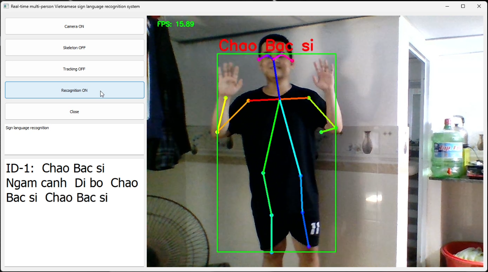
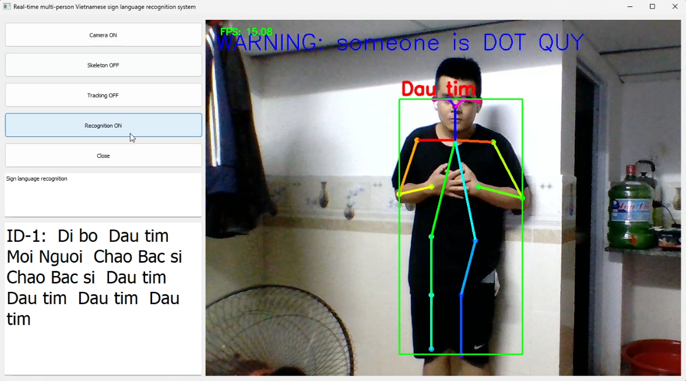
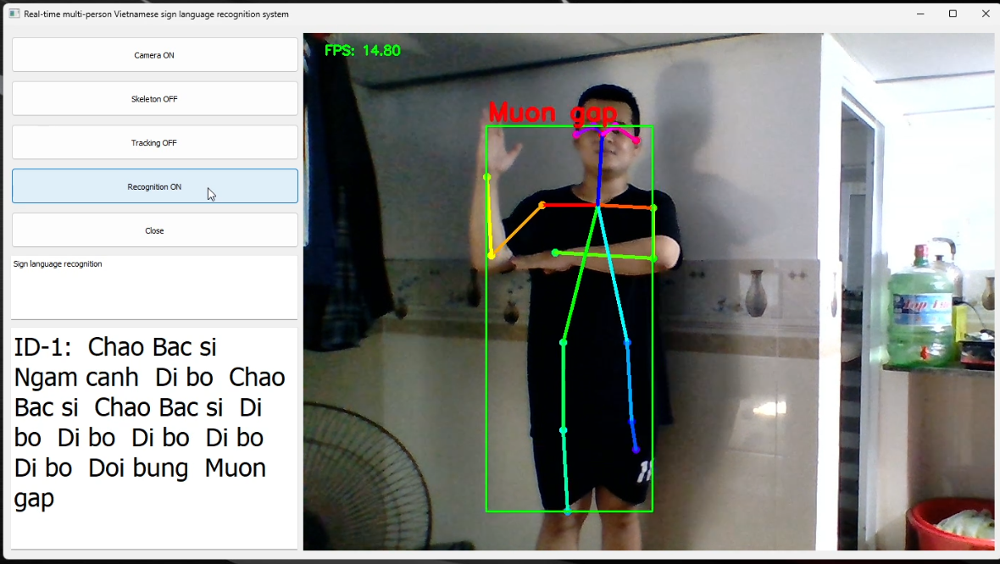
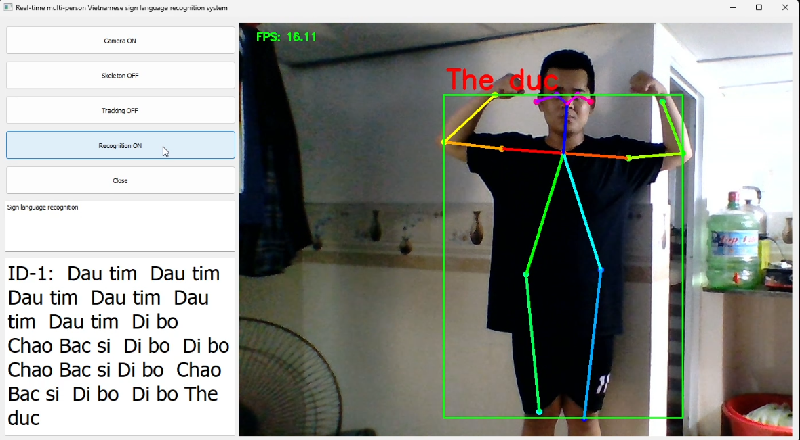

-*- coding: utf8 -*-

TRƯỜNG ĐẠI HỌC BÁCH KHOA - ĐẠI HỌC ĐÀ NẴNG

KHOA ĐIỆN TỬ - VIỄN THÔNG

       NGUYEN XUAN THANH - 106190035
       
       NGUYEN TRAN MINH - 106190024
       
DE TAI: ỨNG DỤNG MÔ HÌNH NHẬN DẠNG HÀNH VI HỖ TRỢ GIÁM SÁT THÔNG MINH TẠI VIỆN DƯỠNG LÃO

Tách và phân tích đặc trưng khung xương trên video RGB

Chương trình chạy trên môi trường Anaconda

## B1: Cài các thư viện cần thiết

$ pip install -r requirements.txt

## B2: Build c++ library for post processing. 

See : https://github.com/ildoonet/tf-pose-estimation/tree/master/tf_pose/pafprocess

$ cd tf_pose/pafprocess

$ swig -python -c++ pafprocess.i && python3 setup.py build_ext --inplace

Sau khi cài các thư viện và build C++ library thành công

## B3: Collect data

$ python collect_data.py

## B4: Mở file "trainnew162.ipynb" bằng jupyter-notebook để train và đánh giá mô hình.

## B5: Bỏ file đã train vào folder "model" và tiến hành chạy nhận diện

$ python recognize.py

Các kết quả đạt được của đề tài:

## Result

[Video hướng dẫn](https://youtu.be/K2OVymWRZcQ)

## Lưu ý: 
- Có thể chọn lựa các model ước tình khung xương trong folder "models"
- Chương trình sẽ thực thi nhanh hơn khi sử dụng tensorflow-gpu
- Chương trình sẽ thực thi nhanh hơn khi sử dụng phần cứng có card màn hình
